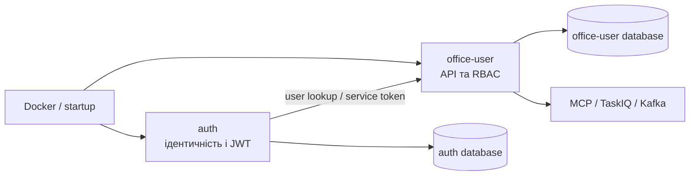

# Findesk: карта auth + office-user

Це публічна read-only сторінка архітектурної карти. Вона містить лише санітизовані метадані: назви файлів, функцій/класів, імпорти, шари, tour і structural fingerprints. Вихідний код, тіла функцій, секрети, значення env/config, приватні URL, ключі, credentials та AI prompt-bearing матеріали не публікуються.

> Увага: цей GitHub URL буде публічним. Не використовуйте карту як джерело секретної інформації.

## Знімок

- Джерело: `EON-plus-dev/Findesk-prod`, гілка `staging`
- Commit: `801d198d1792d7a9e9d55225d78b68ea4939c82d`
- Scope: `auth/` та `office-user/`
- Файлів у scan: **283**; файлів, відфільтрованих ignore: **12 650**
- Вузлів: **1 332**
- Зв’язків: **3 647**
- Архітектурних шарів: **7**
- Кроків tour: **8**
- Structural fingerprints: **283** файли

## Огляд взаємодії

## Шари

1. Точки входу — FastAPI entrypoints, життєвий цикл і health endpoints.
2. API та маршрутизація — HTTP routers і зовнішні контракти.
3. Прикладна логіка — security, services, schemas та правила доступу.
4. Збереження — database, models і migrations.
5. Інтеграції — MCP, Kafka, TaskIQ і service-to-service взаємодія.
6. Операційний шар — Docker, compose і CI/CD конфігурація.
7. Підтримувальні компоненти — документація, утиліти та інші файли scope.

## Tour

1. Огляд двох сервісів і їхніх entrypoints.
2. Запуск та життєвий цикл FastAPI.
3. HTTP API і маршрутизація.
4. Ідентичність, JWT і service-token у `auth`.
5. Споживання ідентичності та RBAC у `office-user`.
6. Моделі й бази даних.
7. MCP, події та фонові задачі.
8. Контейнеризація і запуск.

Повний read-only граф: [architecture-map.json](./architecture-map.json). Файл містить лише структурні вузли та зв’язки, без полів із вихідним кодом.

Structural baseline: [structural-fingerprints.json](./structural-fingerprints.json).

## Web viewer

Статичний viewer лежить у [`site/`](./site/), не потребує npm/node і використовує лише відносні assets та graph data. Після merge цього PR у `main` і ввімкнення GitHub Pages → **Source: GitHub Actions** очікувана HTTPS-адреса:

<https://eon-plus-dev.github.io/Findesk-architecture-map/>

Workflow: [Deploy sanitized architecture viewer](./.github/workflows/pages.yml).

## Останні зміни

- `801d198` · 2026-08-10 · Merge pull request #3577: staging update for contractor payment cancellation.

## Історія змін карти

- Поточний baseline побудовано з точного staging commit `801d198d1792d7a9e9d55225d78b68ea4939c82d`.
- Для наступного оновлення потрібно повторити deterministic scan на новому commit, порівняти fingerprints і пройти той самий privacy/integrity gate.

## Перевірки

- Referential integrity: 0 critical issues.
- Layer coverage: кожен вузол із `filePath` входить рівно до одного шару.
- Tour references: без dangling-посилань.
- Privacy scan: без env/secret/AI prompt-bearing/test paths і без code-like summaries.
- SHA-256 `architecture-map.json`: `a6caed9926145279d8f34b0adf06b2a7290a9312aa194ffd32217d092b2a74da`.
- SHA-256 `structural-fingerprints.json`: `65c6d46b3a72c0c177501904b3b68530876a8a857bd15a29fbc223b5ce309e51`.
